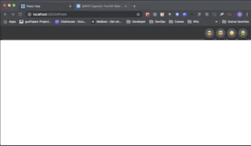

# Animated Dropdown Menu

This is just an example of an animated dropdown menu with nested submenus and animation transition between submenus.
<p align="center">

</p>
It's written in Typescript and missing just a few types related to **react-transition-group** due to lack of documentation

## How to use?
If you want to checkout, just clone this repo and try it out:

```bash
$ yarn install

$ yarn start
```

## Instruction
Only the last menu (the right one) has submenu content, and only the submenus "Settings" and "Animals" have a submenu.

All the other menu items are there just to demonstrate the height transition animation.

## Copyright
This project is under MIT license.

## Contact
Developed and maintained by [@gusflopes](https://github.com/gusflopes).